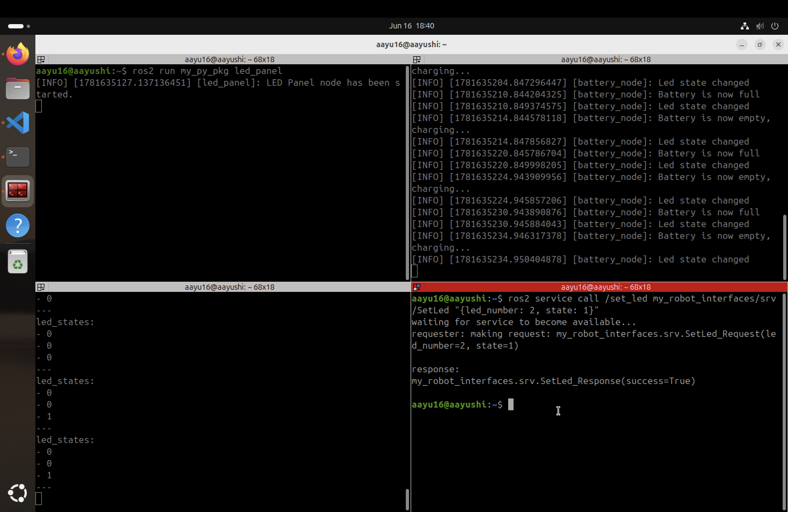
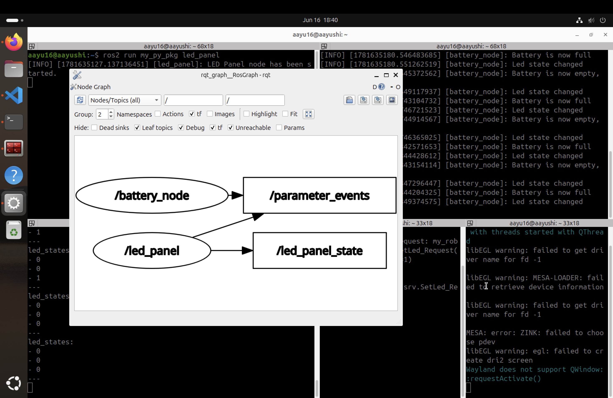

# ROS 2 Battery LED System

A ROS 2 project that simulates a battery monitoring system and an LED panel using custom messages and custom services. The project demonstrates communication between ROS 2 nodes through publishers, subscribers, service clients, and service servers.

## Overview

This project consists of two ROS 2 nodes:

* **Battery Node** – Simulates the battery state (FULL or EMPTY).
* **LED Panel Node** – Manages the state of an LED panel and publishes its current status.

The battery state changes automatically over time:

* After 4 seconds, the battery becomes **EMPTY**.
* The Battery Node sends a service request to turn on an LED.
* After 6 more seconds, the battery becomes **FULL**.
* The Battery Node sends another service request to turn off the LED.
* This cycle repeats continuously.

## Features

* Custom ROS 2 Message (`LedStateArray.msg`)
* Custom ROS 2 Service (`SetLed.srv`)
* Service Client and Service Server implementation
* Publisher and Subscriber communication
* Timer-based battery state simulation
* Modular ROS 2 package structure
* Python-based ROS 2 nodes

## Project Structure

```text
ros2-battery-led-system/
│
├── my_interfaces/
│   ├── msg/
│   │   └── LedStateArray.msg
│   ├── srv/
│   │   └── SetLed.srv
│   ├── CMakeLists.txt
│   └── package.xml
│
├── my_py_pkg/
│   ├── my_py_pkg/
│   │   ├── battery.py
│   │   ├── led_panel.py
│   │   └── __init__.py
│   ├── setup.py
│   ├── setup.cfg
│   └── package.xml
│
|── assets
│
└── README.md
```

## Custom Message

### LedPanelState.msg

```text
int64[] leds_array
```

Example:

```text
[0, 0, 0]
```

Where:

* `0` = LED OFF
* `1` = LED ON

## Custom Service

### SetLed.srv

Request:

```text
int64 led_number
int64 state
```

Response:

```text
bool success
```

## System Workflow

1. Battery starts in the **FULL** state.
2. After 4 seconds, battery becomes **EMPTY**.
3. Battery Node sends a service request to the LED Panel Node.
4. LED Panel Node turns ON the selected LED.
5. LED Panel publishes the updated panel state.
6. After 6 seconds, battery becomes **FULL** again.
7. Battery Node sends another service request.
8. LED Panel turns OFF the LED.
9. The process repeats indefinitely.

## Technologies Used

* ROS 2
* Python
* Ubuntu
* Custom ROS 2 Interfaces
* Colcon Build System

## Build Instructions

Navigate to your ROS 2 workspace:

```bash
cd ~/ros2_ws
```

Build the packages:

```bash
colcon build --packages-select my_py_pkg --symlink-install
```

Source the workspace:

```bash
source install/setup.bash
```

## Running the Project

### Terminal 1

Run the LED Panel Node:

```bash
ros2 run my_py_pkg led_panel
```

### Terminal 2

Run the Battery Node:

```bash
ros2 run my_py_pkg battery
```

## Example Output

```text
Battery State: EMPTY
Sending request to turn LED ON...

LED 1 turned ON

Battery State: FULL
Sending request to turn LED OFF...

LED 1 turned OFF
```

## Output Screenshot



## rqt_graph



## Development Environment

This project was developed and tested on **Ubuntu running inside UTM on a MacBook**. ROS 2 packages were built using the Colcon build system and implemented in Python.

## Learning Outcomes

This project helped me gain practical experience with:

* Creating custom ROS 2 messages
* Creating custom ROS 2 services
* Implementing service servers and clients
* Publishing and subscribing to custom topics
* Managing node communication in ROS 2
* Structuring multi-package ROS 2 projects
* Building and running ROS 2 applications using Python

## Future Improvements

* Support multiple LEDs
* Add LED state visualization using RViz
* Create a launch file for easier execution
* Add battery percentage simulation
* Extend the system with additional sensors and actuators
